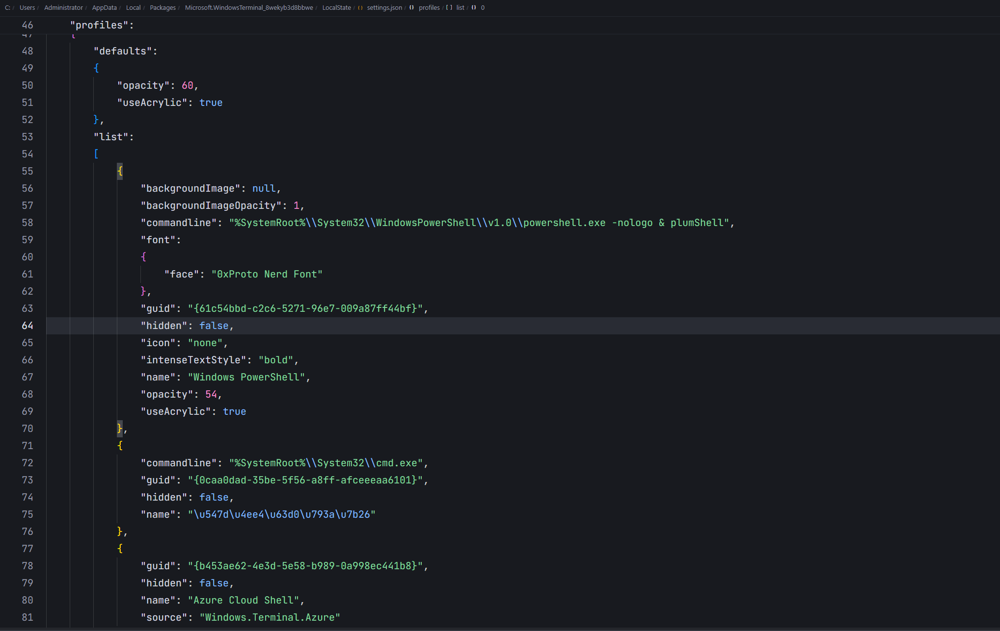

# plumShell

#### 一个基于 Python 的命令行工具

## ✨特点

- 🚀高效工作:
  除了内置的关键字命令，还会同时保存调用用户输入过的命令进行动态的提示和补全

- 📦DIY尺度:
  在plumShell中您可以添加自己的命令，相关内容可以查看[这里]()

- 📖全开源:
  您可以在 Github 上查看完全开放的源代码, 使用 MIT 协议, 您可以参考学习等

## 如何使用

### 安装

在Release中下载压缩包文件，解压到你觉得可以放它的文件夹。

> [!TIP]
> 目前只支持Windows系统

### 配置全局环境变量

1. 复制当前plumShell.exe所在的路径
2. 打开控制面板，搜索“编辑系统环境变量”，点击“编辑系统环境变量”
3. 点击“环境变量”，在“系统变量”中找到“Path”，点击“编辑”
4. 点击“新建”，将第一步复制的路径粘贴到新建的环境变量中

### 配置PowerShell启动参数(适用新PowerShell)

1. 打开PowerShell的设置

2. 打开`设置`
3. 点击左下角`打开JSON文件`
4. 找到`"commandline"`,然后在它的值里面添加`plumShell`，如果已经有其他内容了，就加` & `跟着`plumShell`

